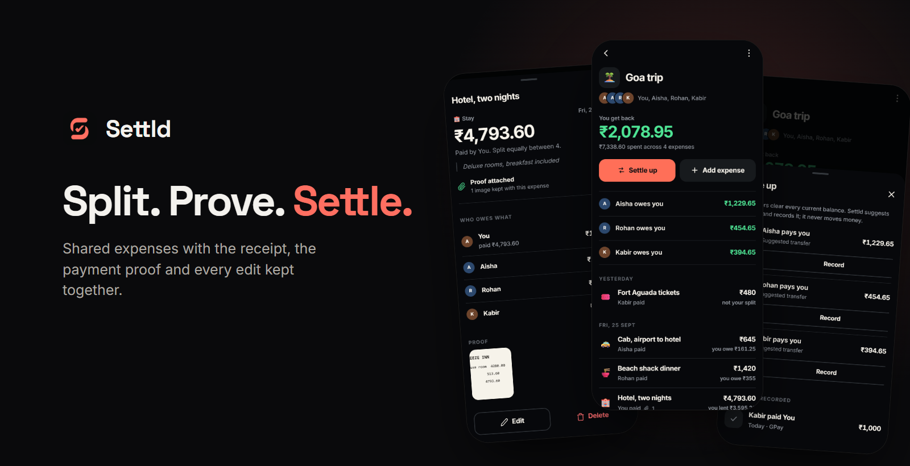
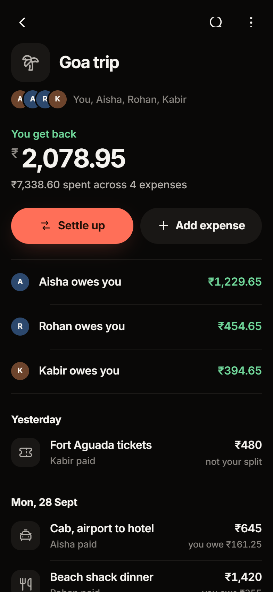
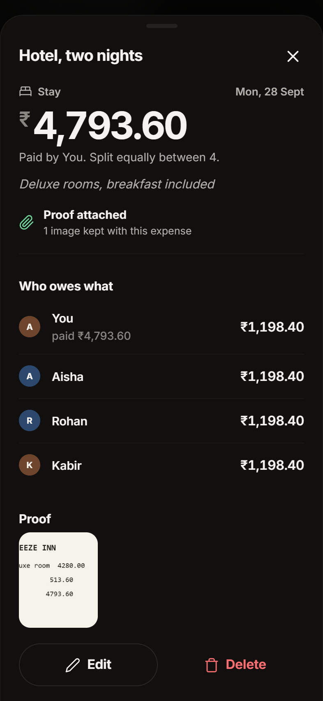
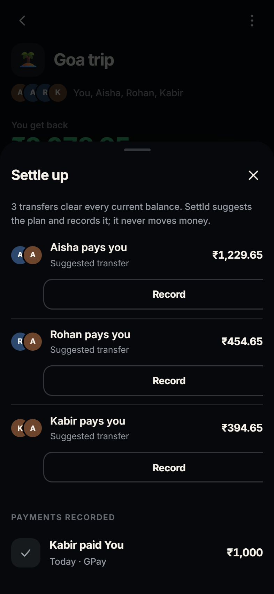
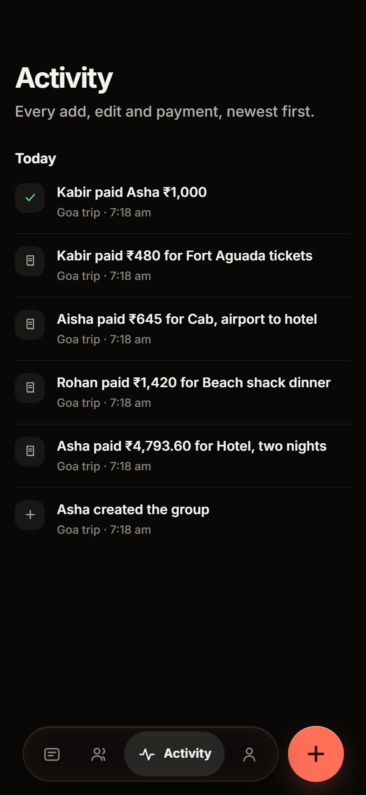
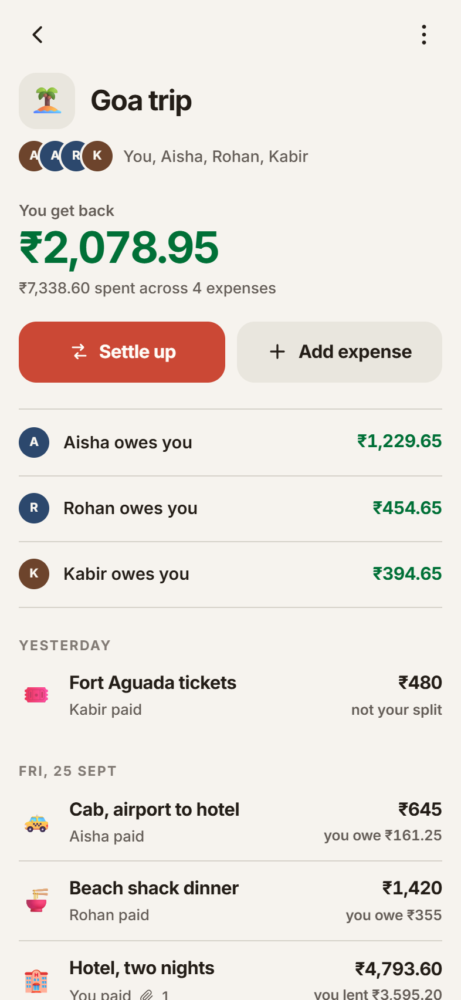

<p align="center">
  
</p>

<p align="center">
  <strong>Shared expenses for trips, homes and groups, with the receipt, the payment proof and every edit kept together.</strong><br>
  Offline-first, no account needed to start, and a settle plan of at most one transfer per person.
</p>

<p align="center">
  <a href="https://settld-ruddy.vercel.app"><strong>Open Settld</strong></a>
  &nbsp;·&nbsp;
  <a href="#features">Features</a>
  &nbsp;·&nbsp;
  <a href="#data-and-firebase">Data and Firebase</a>
  &nbsp;·&nbsp;
  <a href="#run-locally">Run locally</a>
</p>

<p align="center">
  
  
  
  
</p>

## Why Settld

Splitting apps are good at the maths and bad at the argument that comes after it. "Did you actually pay the hotel?" "Who changed this to ₹900?" Settld keeps the proof with the expense: the bill, the UPI screenshot, and an append-only trail of every edit, deletion and payment.

It works on the device first. IndexedDB is the source of truth, every core flow works without signing in, and signing in with Google only adds a backup and shared groups.

Settld calculates and records suggested payments; **it does not hold funds, initiate transfers or process payments**.

## Screenshots

<table>
  <tr>
    <td align="center"><br><sub>A group on one screen</sub></td>
    <td align="center"><br><sub>An expense and its proof</sub></td>
    <td align="center"><br><sub>The settle plan</sub></td>
    <td align="center"><br><sub>Every change, kept</sub></td>
    <td align="center"><br><sub>The light theme</sub></td>
  </tr>
</table>

## Features

- Groups, members, and equal, exact, percentage, or shares-based expense splits
- A group as one scrolling screen: your position, who owes whom, then expenses by day
- Receipt and payment-proof attachments, compressed on-device
- Recomputed balances and a settle plan of at most `members - 1` transfers
- Friends: every person you share a group with, netted across all of them
- An append-only history for expenses, edits, deletions, and recorded payments
- Optional UPI deep links that open the user's payment app
- Dark and light themes, each designed rather than inverted, plus six selectable accents
- Responsive layouts, keyboard focus states, accessible sheets, and 48 px minimum touch targets
- An invented sample trip to explore before creating anything

## Data and Firebase

Local mode stores the ledger and proof in IndexedDB on that device. When a user signs in with Google, Settld mirrors their data to Firebase and restores it on another signed-in device:

- Firebase project: `settld-in`
- Authentication: Google is enabled; `settld-ruddy.vercel.app` is authorized
- Firestore: `(default)` database in `asia-south1`
- Security: records live below `users/{uid}/...`; deployed rules enforce that UID, the allowed collections, document shapes, and proof-size limits
- Sync: failed writes enter a serialized offline outbox; newer mutable records win, while tombstones keep hard deletions from being resurrected by stale devices
- Proof: compressed attachments are stored as base64 in Firestore documents so the app does not depend on Firebase Storage

### Shared groups

Sharing is opt-in per group. Until someone taps Share, a group stays on the personal `users/{uid}/...` path and nothing about its behaviour changes.

When a group is shared it moves to a top-level `groups/{gid}` document with a `memberUids` array, and its expenses, settlements, events, and proof become subcollections underneath. Every member reads and writes the same ledger. The group is removed from the personal backup at that point so the two paths never both claim it.

- **Joining** is by invite link, `#/join/<gid>`. The group id is an unguessable UUID, so the trust boundary is whoever holds the link. A joiner signs in with Google, then either claims an existing name in the group, which hands them that name's balance, or joins as a new person.
- **Rules** let any signed-in caller fetch a group by id, because an invitee has to see what they are joining, but the collection can never be listed. Joining may only append the caller's own uid and at most one member row: it cannot seize ownership, rename the group, or drop anybody. The ledger underneath requires membership. Events are append-only for everybody, including the owner. Only the owner can delete the group.
- **Cost**: this stays entirely inside the Firestore free tier. Shared groups are pulled when the app returns to the foreground rather than held open on realtime listeners, and proof is still base64 inside Firestore documents, so no Storage, no Cloud Functions, and no billing account are required.
- Phone-number lookup is deliberately not implemented. Verifying a number needs SMS, which is billable, and an unverified number is a spoofing risk. Invite links carry the whole flow instead.

Members trust each other with the ledger, in the same way they already do in person: anybody in a group can edit any expense in it.

The first Google account used on a device claims its local dataset. Settld blocks a different account from merging with that data until the user exports or erases it, preventing cross-account ledger and proof leakage. Erasing while signed in deletes the device copy, writes an account reset marker, and removes the Firebase mirror.

Production authentication is Google-only. Phone authentication is intentionally omitted until SMS billing and abuse controls are configured.

## Run locally

Node.js 22 is the CI version.

```sh
npm ci
npm start
```

Open `http://localhost:5173`. Any static HTTP server can serve the repository; ES modules will not work correctly by opening `index.html` through `file://`.

## Test

```sh
npm test            # ledger arithmetic and settlement invariants
npm run test:e2e    # mobile Chromium product flow via Playwright
npm run test:rules  # Firestore security rules, multi-user, on the emulator
```

`test:rules` runs the Firestore emulator, which needs a JDK at version 21 or above on `PATH`.

`python scripts/readme-shots.py` rebuilds the screenshots in this README from the live app, in local mode with the sample trip.

Playwright starts the local server when one is not already running. GitHub Actions runs both suites for pull requests and pushes to `main`.

## Deploy

The GitHub repository is connected to Vercel. A push to `main` triggers the production deployment automatically; routine releases do not need a separate `vercel --prod` command.

Firestore rule changes are deployed explicitly:

```sh
firebase deploy --only firestore:rules --project settld-in
```

The deployed rules pin each document's exact key set, so a new field on any synced record needs a rules deploy before the release that writes it. The v0.4 rules (profile `phone` and `accent`) are live.

### Content Security Policy

`vercel.json` must keep `https://apis.google.com` in `script-src`. Firebase Auth loads `apis.google.com/js/api.js` for its popup and redirect resolver, and without it every Google sign-in fails before a popup opens. This is invisible to local testing because Vercel headers do not apply on `localhost`.

## Ledger invariants

- Money is stored as integer paise; ledger math never uses floating-point currency values.
- Split rounding uses deterministic largest-remainder distribution, with member ID as the tie-breaker.
- Balances are derived from expenses and settlements rather than stored as mutable totals.
- Deleted records are soft-deleted, while the activity trail remains append-only.

## Project map

```text
index.html                 App shell and PWA entry point
css/app.css                Coral design tokens, components, and responsive layouts
js/app.js                  Router, screens, sheets, and rendering
js/store.js                State, actions, event trail, and sample data
js/db.js                   IndexedDB persistence
js/cloud.js                Google auth and per-UID Firestore mirror
js/money.js                Deterministic currency and split math
js/settle.js               Balances, transfer plan, and UPI links
tests/ledger.test.mjs      Ledger unit tests
tests/e2e/app.spec.mjs     Playwright product-flow coverage
firestore.rules            Per-UID Firestore access policy
PRODUCT.md                 Product scope and principles
scripts/readme-shots.py    README screenshots
DESIGN.md                  Visual system and component rules
```

## Current limits

- INR only
- Google sign-in only; no phone or Apple sign-in
- Shared groups sync on foreground, not in realtime, to stay inside the free tier
- Proof stored in Firestore is subject to the document-size guard in `js/cloud.js`
- No way to find someone by phone number, because verifying one costs money

## Licence

Copyright © 2026 Gaurav Kumar, [The Algothrim](https://thealgothrim.com). All rights reserved.

The code is public to read and learn from. It is not licensed for reuse.
